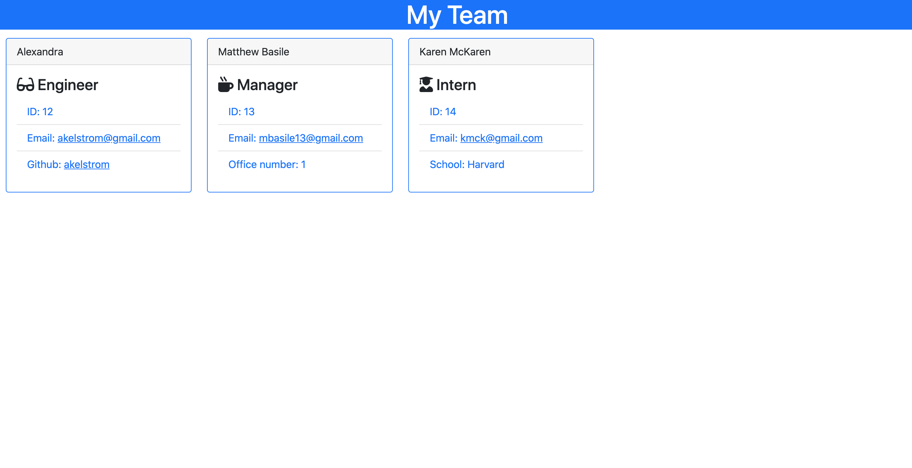
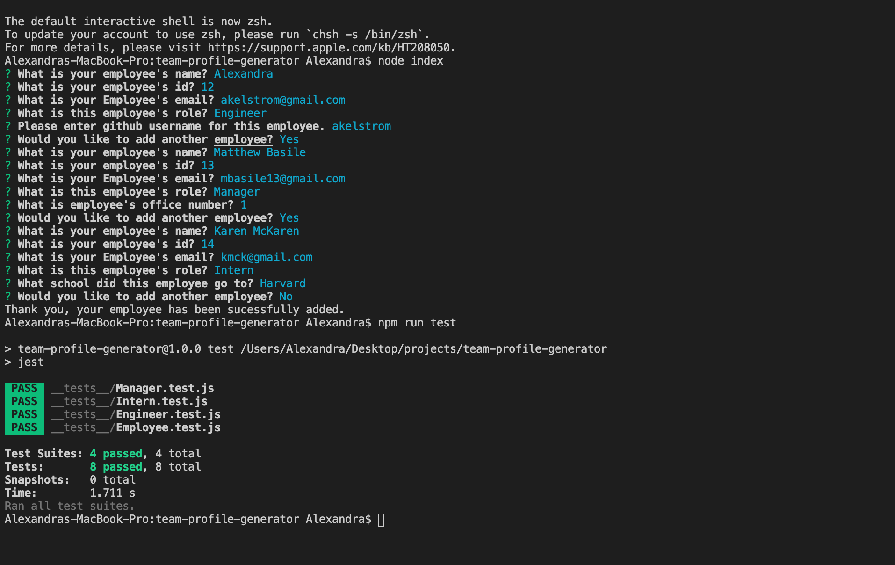

# Team Profile Generator

## Description
This is an app that allows you to input employee information, which gets written to a generated "index.html" file in the `dist` folder as a "Team Profile" page. 

## Installation
Make sure to have `node.js` installed.

## Usage
In order to use this application, fork and clone the repo and open in VS-code. Open up the terminal and navigate to the root directory. Run the command `node index`. Then answer the prompted questions, and once you are finished your result will be in the `dist` folder under `index.html`.

### Screenshot

## Tech Used
* Node.js
* NPM Inquirer
* Jest
* JavaScript
    * Object Orriented Programming
* CSS
    * Bootstrap
    * Font Awesome
* HTML

## Credits
Big thanks to my Tutor, and the Upenn Bootcamp's instructional team!

